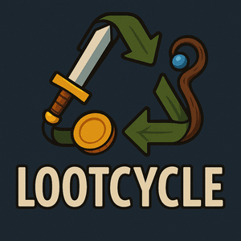

# Lootcycle

Lootcycle is a Crafting Claw Machine Management Sim where you transform dungeon trash into valuable items. Manage your recycling station, control temperature, craft rare items, and upgrade your equipment. Turn adventurers' junk into your treasure!

## Licensing

This project is licensed under the MIT License - see the [LICENSE](LICENSE) file for details.

### Acknowledgments

This game is built upon the [Phaser Vite Template](https://github.com/phaserjs/template-react-ts) created by Phaser Studio Inc.
The original template is licensed under the MIT License.
